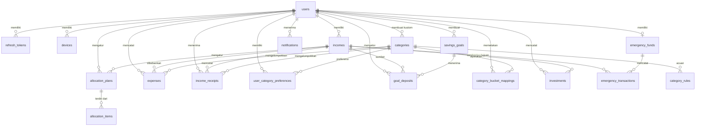

PRD: Aplikasi Pencatatan & Perencanaan Keuangan Pribadi
Tanggal: 3 Oktober 2026 | Versi: 0.1 (Draft) | Status: Untuk ditinjau | Nama produk: (sementara) CatatDuit
---
1. Ringkasan Produk
CatatDuit adalah sistem pencatatan keuangan pribadi yang terdiri dari tiga komponen terintegrasi: Back-End (API dan logika bisnis), Front-End Web, dan aplikasi mobile Flutter (Android dan iOS). Ketiganya memakai satu akun dan satu sumber data, sehingga transaksi yang dicatat di ponsel langsung terlihat di web, dan sebaliknya.
Inti produk: pengguna memasukkan pendapatan, lalu mencatat pengeluaran yang dikaitkan ke sumber pendapatan tersebut. Pencatatan dibuat semudah mengetik kalimat, misalnya `"saya beli bakso 10k"`, dan sistem mengisi nominal serta kategori secara otomatis. Di atas pencatatan, produk berkembang menjadi alat perencanaan: target menabung untuk membeli barang, rekomendasi dana darurat, dan alokasi pendapatan bulanan untuk belanja dan investasi.
---
2. Latar Belakang & Masalah
Banyak orang tidak tahu ke mana uang mereka pergi setiap bulan karena pencatatan manual terasa merepotkan.
Pengguna jarang punya rencana yang jelas untuk membeli barang impian, sehingga menabung tidak terarah.
Sebagian besar pengguna tidak siap menghadapi kebutuhan mendadak karena belum punya dana darurat.
Pendapatan yang masuk sering habis tanpa pembagian yang jelas antara kebutuhan, keinginan, tabungan, dan investasi.
Peluang: pencatatan yang terhubung langsung ke sumber pendapatan dan sangat cepat dilakukan (input kalimat bebas), lalu berkembang bertahap menjadi perencanaan keuangan.
---
3. Tujuan & Metrik Keberhasilan
Tujuan Produk
Membuat pencatatan transaksi selesai dalam waktu kurang dari 10 detik.
Memberi pengguna gambaran jelas sisa dana dari tiap sumber pendapatan.
Membantu pengguna menyisihkan uang secara terencana untuk target barang, dana darurat, dan investasi.
Menyediakan pengalaman yang konsisten dan data yang selalu sinkron di web dan mobile.
Metrik
Metrik	Target Awal
Pengguna aktif bulanan (MAU)	Ditetapkan setelah peluncuran beta
Rata-rata transaksi tercatat per pengguna per minggu	$\ge 10$
Akurasi kategorisasi otomatis	$\ge 85%$
Tingkat koreksi kategori manual	$\le 20%$
Waktu rata-rata mencatat satu transaksi	$< 10$ detik
Pengguna yang membuat minimal satu target tabungan	$\ge 30%$ (setelah Fase 2)
Retensi pengguna hari ke-30	$\ge 25%$
Sinkronisasi antar platform	$< 5$ detik pada koneksi normal
---
4. Target Pengguna
Persona	Karakteristik	Kebutuhan Utama
Rina, pekerja kantoran	Gaji tetap, sedikit freelance	Tahu sisa gaji, menabung untuk laptop, punya dana darurat
Dimas, freelancer	Pendapatan tidak tetap	Alokasi berbasis persentase, dana darurat lebih besar
Sari, mahasiswa	Uang saku bulanan, pengeluaran kecil dan sering	Pencatatan cepat, batas jajan, target barang kecil
Platform utama adalah mobile (pencatatan harian di mana saja), sedangkan web dipakai untuk melihat laporan yang lebih detail, mengelola kategori, dan analisis bulanan.
---
5. Ruang Lingkup & Roadmap
Fase	Cakupan	Cakupan Platform
Fase 1 (MVP)	Akun, input pendapatan, pencatatan pengeluaran, kategori, Smart Entry (kategorisasi otomatis), ringkasan	Back-End + Flutter + Web
Fase 2	Target menabung untuk membeli barang	Back-End + Flutter + Web
Fase 3	Rekomendasi dana darurat	Back-End + Flutter + Web
Fase 4	Alokasi pendapatan bulanan (spend & invest)	Back-End + Flutter + Web
Di luar ruang lingkup (saat ini): integrasi otomatis ke rekening bank atau e-wallet, transaksi jual-beli investasi langsung, scan struk, input suara, dan fitur keuangan bersama (multi-user dalam satu akun). Fitur investasi bersifat pencatatan dan edukasi, bukan nasihat investasi resmi.
---
6. Gambaran Arsitektur Sistem
6.1 Diagram Tingkat Tinggi
```text
+-----------------------+       +-----------------------+
|   Flutter (Mobile)    |       |    Front-End (Web)    |
|   Android / iOS       |       |    SPA / SSR          |
|   - UI & state        |       |    - Dashboard        |
|   - Cache lokal       |       |    - Laporan          |
|   - Antrian offline   |       |    - Pengaturan       |
+-----------------------+       +-----------------------+
            |                               |
            +---------------+---------------+
                            | HTTPS + JSON (REST)
                            v
                 +---------------------+
                 |     API Gateway     | (auth, rate limit, versioning)
                 +---------------------+
                            |
                            v
     +---------------------------------------------+
     |                  Back-End                   |
     | Auth | Income | Expense | Category          |
     | Smart Entry (parser/classifier)             |
     | Savings Goal | Emergency Fund               |
     | Allocation | Report | Notification          |
     +---------------------------------------------+
                |                       |
                v                       v
     +---------------------+ +---------------------+
     |     PostgreSQL      | |   Redis (cache,     |
     |    (data utama)     | |     job queue)      |
     +---------------------+ +---------------------+
```
6.2 Pembagian Tanggung Jawab
Komponen	Tanggung Jawab	Bukan Tanggung Jawab
Back-End	Seluruh logika bisnis: autentikasi, validasi, kalkulasi saldo, parsing dan kategorisasi, perhitungan target tabungan, dana darurat, alokasi, laporan, notifikasi, penyimpanan data	Tampilan dan interaksi UI
Front-End Web	Tampilan dashboard, grafik dan laporan, pengelolaan kategori dan pengaturan, input transaksi dari browser	Menghitung ulang logika bisnis (hanya menampilkan hasil dari API)
Flutter Mobile	Input cepat (Smart Entry), tampilan ringkas harian, notifikasi push, cache dan antrian offline	Logika bisnis inti (hanya validasi ringan di sisi klien)
Prinsip utama: satu sumber kebenaran (single source of truth). Semua perhitungan penting (saldo, nominal setoran, target dana darurat, sisa pos alokasi) dilakukan di Back-End agar hasil di web dan mobile selalu sama.
6.3 Usulan Teknologi
Usulan awal, dapat disesuaikan dengan keahlian tim.
Lapisan	Usulan	Catatan
Back-End	Node.js (NestJS) atau Laravel atau Go	Pilih satu yang paling dikuasai tim. Gaya REST dengan versi API (`/api/v1`)
Database	PostgreSQL	Nominal uang disimpan sebagai integer (rupiah, tanpa desimal), bukan float
Cache & Antrian	Redis	Cache ringkasan, job terjadwal (notifikasi, hitung ulang target)
Front-End Web	React (Next.js) atau Vue (Nuxt)	Responsif, dukungan mobile browser
Mobile	Flutter (Dart)	State management Riverpod atau Bloc, HTTP client Dio, database lokal Drift atau Isar
Autentikasi	JWT access token + refresh token	Penyimpanan token aman (Keychain/Keystore di mobile)
Notifikasi	Firebase Cloud Messaging	Push di Android dan iOS, email opsional untuk web
Dokumentasi API	OpenAPI (Swagger)	Menjadi kontrak bersama antara Back-End, Web, dan Flutter
Infrastruktur	Docker, CI/CD, cloud (mis. VPS atau layanan cloud)	Lingkungan dev, staging, production
6.4 Kontrak Integrasi
Seluruh klien memakai API yang sama; tidak ada endpoint khusus platform kecuali kebutuhan notifikasi (registrasi device token).
Format respons dan error seragam, misalnya `{ "data": ..., "error": { "code": "...", "message": "..." } }`.
Kontrak OpenAPI dibuat lebih dulu, lalu klien web dan Flutter dibuat dengan code generation atau mock server sehingga pengembangan tiga komponen dapat berjalan paralel.
Perubahan API yang merusak (breaking change) hanya lewat versi baru (`/v2`).
---
7. Alur Pengguna Utama
Onboarding: daftar atau masuk, lalu input pendapatan pertama (sumber, nominal, frekuensi), lalu pilih pendapatan utama.
Pencatatan cepat (Smart Entry): ketik `"saya beli bakso 10k"`, sistem mem-parsing, tampil kartu konfirmasi (item, nominal, kategori, sumber pendapatan), pengguna menyimpan atau mengedit, transaksi tercatat, saldo diperbarui.
Lihat ringkasan: dashboard menampilkan sisa saldo per pendapatan, pengeluaran per kategori, dan riwayat transaksi.
Target barang (Fase 2): buat target, lihat nominal bulanan dan pembagian per pendapatan, catat setoran, pantau progres.
Dana darurat (Fase 3): jawab pertanyaan profil, terima target dan pilihan jangka waktu, pantau progres.
Alokasi bulanan (Fase 4): pilih template alokasi, sesuaikan, pantau sisa tiap pos, lihat ringkasan akhir bulan.
---
8. Kebutuhan Fungsional
Prioritas memakai MoSCoW: M = Must, S = Should, C = Could.
8.1 Fase 1: Fitur Inti (MVP)
ID	Fitur / User Story	Prioritas	Platform
P1-01	Sebagai pengguna, saya dapat mendaftar, masuk, dan keluar dengan aman	M	Semua
P1-02	Saya dapat memasukkan pendapatan (sumber, nominal, frekuensi, tanggal) dan mengelola lebih dari satu pendapatan	M	Semua
P1-03	Saya dapat mencatat pengeluaran yang dikaitkan ke sumber pendapatan tertentu	M	Semua
P1-04	Saya dapat mengetik kalimat bebas ("beli bakso 10k") dan sistem mengisi nominal, item, dan kategori	M	Semua
P1-05	Saya dapat mengonfirmasi atau mengoreksi hasil parsing sebelum disimpan	M	Semua
P1-06	Sistem mengingat koreksi kategori saya untuk transaksi berikutnya	S	Back-End
P1-07	Saya dapat melihat, mengubah, dan menghapus transaksi	M	Semua
P1-08	Saya dapat memakai kategori default dan membuat kategori kustom	M	Semua
P1-09	Saya dapat melihat sisa saldo per pendapatan dan total pengeluaran per kategori	M	Semua
P1-10	Saya dapat mencatat transaksi saat offline dan data tersinkron otomatis saat online	S	Flutter
P1-11	Saya dapat melihat grafik dan laporan bulanan yang dapat difilter	S	Web (utama)
P1-12	Saya dapat mengekspor data transaksi ke CSV	C	Web
Acceptance criteria utama (P1-04):
Format nominal Indonesia dikenali: `10k`, `10rb`, `10 ribu`, `1,5jt`, `Rp 10.000`.
Kata kunci jenis transaksi dikenali (`beli`, `bayar`, `jajan` $\rightarrow$ pengeluaran; `gajian`, `terima`, `dapat` $\rightarrow$ pemasukan).
Tanggal relatif dikenali (`"kemarin"`, `"tadi pagi"`); default adalah hari ini.
Jika kategori tidak yakin, sistem menampilkan 2–3 saran.
Waktu respons parsing di bawah 2 detik.
8.2 Fase 2: Target Menabung untuk Membeli Barang
ID	User Story	Prioritas
P2-01	Saya dapat membuat target barang (nama, harga, tenggat) dan memiliki lebih dari satu target	M
P2-02	Saya tahu berapa yang harus disisihkan per bulan: `(harga - terkumpul) / sisa bulan`, dibulatkan ke atas	M
P2-03	Saya melihat pembagian setoran dari tiap sumber pendapatan (default proporsional, dapat diubah)	M
P2-04	Saya diperingatkan jika setoran bulanan tidak realistis terhadap sisa pendapatan, beserta tawaran tenggat alternatif	S
P2-05	Saya dapat mencatat setoran dan melihat progres (persentase dan nominal)	M
P2-06	Saya dapat mengubah, menjeda, atau membatalkan target; dana yang sudah terkumpul tetap tercatat	S
Kasus khusus: pendapatan tidak tetap memakai rata-rata 3 bulan terakhir; setoran terlewat menyesuaikan nominal bulan berikutnya; target tercapai lebih awal memicu notifikasi dan opsi menutup target.
8.3 Fase 3: Rekomendasi Dana Darurat
ID	User Story	Prioritas
P3-01	Saya mendapat target dana darurat = rata-rata pengeluaran bulanan $\times$ pengali (3–12) sesuai profil	M
P3-02	Saya menjawab maksimal 5 pertanyaan profil (status, tanggungan, kestabilan pendapatan, cicilan) dan melihat alasan pemilihan pengali	M
P3-03	Saya mendapat pilihan setoran bulanan untuk beberapa jangka waktu (mis. 12, 24, 36 bulan)	M
P3-04	Saya memantau progres dana darurat yang terpisah dari saldo harian	M
P3-05	Saya dapat mencatat penarikan dengan alasan, lalu mendapat rencana pengisian kembali	S
P3-06	Saya diberi notifikasi jika rata-rata pengeluaran berubah lebih dari $15%$ agar target disesuaikan	C
8.4 Fase 4: Alokasi Pendapatan Bulanan (Spend & Invest)
ID	User Story	Prioritas
P4-01	Saya dapat membagi tiap pendapatan ke pos kebutuhan, keinginan, tabungan, dan investasi (total $100%$), dengan template seperti 50/30/20	M
P4-02	Saya mendapat rekomendasi alokasi berdasarkan pengeluaran aktual, target barang, dan dana darurat	S
P4-03	Pengeluaran saya otomatis masuk ke pos yang sesuai lewat pemetaan kategori yang dapat diubah	M
P4-04	Saya diperingatkan saat pos mencapai $80%$ dan $100%$	S
P4-05	Saya dapat mencatat dana yang dialokasikan ke investasi (jenis instrumen, nominal, tanggal); aplikasi hanya mencatat	M
P4-06	Saya melihat ringkasan bulanan rencana vs realisasi per pos beserta saran bulan berikutnya	S
Prioritas dana: kebutuhan pokok, dana darurat minimal (1 bulan pengeluaran), target barang, lalu investasi. Fitur Fase 4 menjadi "pengatur utama" yang menampung setoran Fase 2 dan 3 ke pos Tabungan.
---
9. Desain API (Garis Besar)
Semua endpoint berada di bawah `/api/v1` dan memerlukan token kecuali autentikasi. Rincian request, response, dan error tiap endpoint ada di Lampiran A.
Modul	Endpoint Contoh	Fase
Auth	`POST /auth/register`, `POST /auth/login`, `POST /auth/refresh`, `POST /auth/logout`	1
Pendapatan	`GET/POST /incomes`, `PATCH/DELETE /incomes/{id}`	1
Pengeluaran	`GET/POST /expenses`, `PATCH/DELETE /expenses/{id}`	1
Kategori	`GET/POST /categories`, `PATCH/DELETE /categories/{id}`	1
Smart Entry	`POST /smart-entry/parse` (teks $\rightarrow$ hasil terstruktur), lalu `POST /expenses` untuk menyimpan	1
Ringkasan	`GET /summary?month=YYYY-MM`, `GET /reports/categories`	1
Sinkronisasi	`POST /sync/push`, `GET /sync/pull?since=timestamp`	1
Target menabung	`GET/POST /savings-goals`, `POST /savings-goals/{id}/deposits`	2
Dana darurat	`GET/POST /emergency-fund`, `POST /emergency-fund/withdrawals`	3
Alokasi	`GET/PUT /allocations?month=YYYY-MM`, `POST /investments`	4
Notifikasi	`POST /devices` (token push), `GET /notifications`	2–4
Contoh respons parsing:
```json
{
  "data": {
    "raw_input": "saya beli bakso 10k",
    "type": "expense",
    "item": "Bakso",
    "amount": 10000,
    "category": { "id": "cat_food", "name": "Makanan & Minuman" },
    "date": "2026-10-03",
    "income_id": "inc_main",
    "confidence": 0.93,
    "suggestions": []
  }
}
```
---
10. Model Data (Garis Besar)
Diagram ERD dan kamus data lengkap (kolom, tipe, constraint) ada di Lampiran B. Pada Lampiran B, entitas `Income` dipisah menjadi `incomes` (sumber pendapatan) dan `income_receipts` (penerimaan).
Entitas	Atribut Utama	Relasi
User	`id`, `nama`, `email`, `password_hash`, `profil` (status, tanggungan)	1 User $\rightarrow$ banyak Income, Expense, dst.
Income	`id`, `user_id`, `sumber`, `nominal`, `frekuensi`, `tanggal`, `is_primary`	1 Income $\rightarrow$ banyak Expense
Expense	`id`, `user_id`, `income_id`, `category_id`, `item`, `nominal`, `tanggal`, `raw_input`, `confidence_score`, `updated_at`	Milik satu Income dan satu Category
Category	`id`, `user_id` (null untuk default), `nama`, `tipe` (expense/income), `bucket` (kebutuhan/keinginan)	Dipakai Expense dan Income
CategoryRule	`id`, `keyword`, `category_id`	Kamus kata kunci global
UserCategoryPreference	`id`, `user_id`, `keyword`, `category_id`	Hasil koreksi per pengguna
SavingsGoal	`id`, `user_id`, `nama`, `harga`, `tenggat`, `terkumpul`, `status`	1 Goal $\rightarrow$ banyak GoalDeposit
GoalDeposit	`id`, `goal_id`, `income_id`, `nominal`, `tanggal`	Menghubungkan setoran ke sumber pendapatan
EmergencyFund	`id`, `user_id`, `pengali`, `target`, `terkumpul`	1 per pengguna
EmergencyTransaction	`id`, `fund_id`, `tipe` (setor/tarik), `nominal`, `alasan`	Milik satu EmergencyFund
Allocation	`id`, `user_id`, `bulan`, `persen per pos`, `template`	1 per pengguna per bulan
Investment	`id`, `user_id`, `instrumen`, `nominal`, `tanggal`	Tercatat di pos investasi
Device	`id`, `user_id`, `push_token`, `platform`	Untuk notifikasi
Catatan teknis: semua tabel memiliki `created_at`, `updated_at`, dan `deleted_at` (soft delete) untuk mendukung sinkronisasi. Nominal disimpan sebagai `BIGINT` dalam rupiah.
---
11. Sinkronisasi & Mode Offline
Flutter menyimpan cache lokal dan antrian transaksi yang dibuat saat offline.
Saat koneksi kembali, antrian dikirim lewat `/sync/push`; data terbaru diambil lewat `/sync/pull?since=`.
Setiap data memiliki `client_id` (UUID) yang dibuat di klien untuk mencegah data ganda saat pengiriman ulang (idempotensi).
Konflik diselesaikan dengan aturan last-write-wins berdasarkan `updated_at` di server; konflik pada transaksi yang sudah dihapus ditampilkan ke pengguna.
Web tidak wajib mendukung offline pada fase awal.
---
12. Desain & UX
Prinsip: input secepat mungkin, angka mudah dibaca, bahasa Indonesia yang sederhana, dan tampilan konsisten di semua platform lewat satu design system (warna, tipografi, komponen).
Platform	Halaman Utama
Flutter	Beranda (saldo dan ringkasan), kolom Smart Entry di bagian bawah, riwayat, target (tabungan, dana darurat), alokasi, pengaturan
Web	Dashboard dengan grafik, tabel transaksi dengan filter dan pencarian, laporan bulanan, pengelolaan kategori dan alokasi, pengaturan
Format tampilan: Rupiah (`Rp10.000`), tanggal format Indonesia, dukungan mode gelap sebagai pengembangan lanjutan.
---
13. Kebutuhan Non-Fungsional
Aspek	Kebutuhan
Keamanan	HTTPS wajib, password di-hash (bcrypt/argon2), token disimpan aman, enkripsi data sensitif saat disimpan, pembatasan percobaan login (rate limit)
Privasi	Persetujuan penggunaan data, hak hapus akun dan data, kepatuhan terhadap UU Pelindungan Data Pribadi (UU PDP); teks transaksi yang dikirim ke layanan AI eksternal (jika dipakai) tidak boleh memuat data identitas
Performa	Respons API umum $< 500\text{ ms}$ (p95), parsing Smart Entry $< 2\text{ detik}$, dashboard memuat $< 3\text{ detik}$
Ketersediaan	Target uptime $99,5%$ pada tahap awal, backup database harian
Skalabilitas	Back-End stateless sehingga dapat diperbanyak; indeks database pada `user_id` dan `tanggal`
Platform	Android 8+ dan iOS 14+ untuk Flutter; browser modern (Chrome, Safari, Firefox, Edge) untuk web
Lokalisasi	Bahasa Indonesia, mata uang Rupiah, zona waktu WIB/WITA/WIT mengikuti pengguna
Kualitas	Unit test untuk logika kalkulasi (wajib), uji integrasi API, pemantauan error (mis. Sentry), log terstruktur
---
14. Rencana Rilis & Timeline
Estimasi awal, menyesuaikan ukuran tim.
Milestone	Cakupan	Estimasi
M0: Persiapan	Finalisasi PRD, kontrak OpenAPI, design system, wireframe, setup repositori dan CI/CD	2–3 minggu
M1: Fase 1 (MVP)	Auth, pendapatan, pengeluaran, kategori, Smart Entry, ringkasan di Back-End, Flutter, dan Web	8–10 minggu
Beta tertutup	Uji dengan 20–50 pengguna, ukur akurasi kategorisasi dan waktu pencatatan	2–3 minggu
M2: Fase 2	Target menabung	4–5 minggu
M3: Fase 3	Dana darurat	3–4 minggu
M4: Fase 4	Alokasi bulanan dan pencatatan investasi	5–6 minggu
Kriteria rilis tiap fase: semua user story Must selesai di tiga komponen, tidak ada bug kritis, uji UAT lolos, dan metrik performa terpenuhi.
Urutan kerja yang disarankan dalam satu fase: Back-End dan kontrak API lebih dulu, lalu Flutter dan Web dikerjakan paralel memakai mock server, kemudian integrasi dan uji menyeluruh.
---
15. Asumsi, Risiko & Ketergantungan
Asumsi: pengguna cukup disiplin mencatat; pengguna bersedia memasukkan pendapatan di awal; mayoritas pencatatan dilakukan lewat ponsel.
Risiko	Dampak	Mitigasi
Kalimat ambigu ("transfer 500k") atau item multi-kategori ("kopi")	Kategori salah	Layar konfirmasi, saran 2–3 kategori, pembelajaran dari koreksi
Satu kalimat berisi banyak item	Data tidak lengkap	Pecah otomatis menjadi beberapa transaksi dengan konfirmasi
Pendapatan tidak tetap	Rekomendasi tidak akurat	Pakai rata-rata 3 bulan dan alokasi berbasis persentase
Data tidak sinkron antar platform	Kepercayaan pengguna turun	Satu sumber kebenaran, idempotensi, uji sinkronisasi khusus
Fitur investasi dianggap nasihat keuangan	Risiko regulasi	Pernyataan edukasi yang jelas, tanpa transaksi investasi langsung, tinjauan hukum
Kebocoran data keuangan	Dampak sangat tinggi	Enkripsi, audit keamanan, akses minimal
Beban pengembangan tiga komponen sekaligus	Jadwal molor	Kontrak API lebih dulu, cakupan MVP ketat, rilis bertahap
Ketergantungan: layanan push notification (FCM), layanan hosting dan database, layanan AI/NLP (opsional, untuk Smart Entry tahap lanjut), akun developer Google Play dan Apple App Store.
---
16. Pertanyaan Terbuka
Teknologi Back-End dan Web apa yang akan dipakai (menyesuaikan keahlian tim)?
Jika ada beberapa pendapatan, pengeluaran dipotong dari yang mana secara default? Usulan: pendapatan "utama" dengan opsi memilih saat konfirmasi.
Apakah satu kalimat dengan banyak item dipecah otomatis menjadi beberapa transaksi pada MVP?
Apakah Smart Entry memakai aturan + preferensi pengguna dahulu (usulan MVP), atau langsung memakai model AI?
Apakah web wajib setara fitur dengan mobile pada Fase 1, atau web fokus pada laporan dan mobile fokus pada pencatatan?
Apakah ada rencana model bisnis (gratis, langganan, iklan) yang memengaruhi desain?
Apakah input suara dan scan struk masuk roadmap setelah Fase 4?
---
Lampiran
Glosarium:
Smart Entry = input kalimat bebas yang di-parsing otomatis.
Pos = kelompok alokasi (kebutuhan, keinginan, tabungan, investasi).
MoSCoW = metode prioritas (Must, Should, Could, Won't).
Idempotensi = pengiriman ulang data yang sama tidak menghasilkan data ganda.
Langkah berikutnya yang disarankan: menyepakati pertanyaan terbuka nomor 1, 2, dan 5, lalu menyusun kontrak OpenAPI Fase 1 dan wireframe halaman utama.
---
Lampiran A: Spesifikasi API Detail
Bagian ini merinci setiap endpoint pada Bagian 9. Penyesuaian dari draf awal: pendapatan dipisah menjadi sumber pendapatan (`incomes`) dan penerimaan (`income_receipts`) agar saldo per pendapatan dapat dihitung akurat. Kalimat seperti `"gajian 5jt"` tercatat sebagai penerimaan.
A.1 Konvensi Umum
Aspek	Aturan
Base URL	`https://api.catatduit.app/api/v1` (contoh; ditetapkan saat deployment)
Header	`Authorization: Bearer <access_token>`, `Content-Type: application/json`, `X-Client: web/android/ios`, `Idempotency-Key: <UUID>` (opsional, untuk POST dari klien)
Format sukses	`{ "data": ..., "meta": { ... } }`
Format error	`{ "error": { "code": "VALIDATION_ERROR", "message": "...", "details": [ { "field": "amount", "issue": "must be > 0" } ] } }`
Tipe data	Nominal: integer rupiah. Tanggal: `YYYY-MM-DD`. Waktu: ISO 8601 UTC. Bulan: `YYYY-MM`. ID: UUID
Paginasi	`?page=1&limit=20` (maks 100), `meta`: `page`, `limit`, `total`. Urutan: `?sort=-spent_at`
Token	Access token 15 menit, refresh token 30 hari dengan rotasi (token lama dicabut setelah dipakai)
Kode HTTP	`200 OK`, `201 Created`, `204 No Content`, `400 Bad Request`, `401 Unauthorized`, `403 Forbidden`, `404 Not Found`, `409 Conflict`, `422 Validation`, `429 Rate Limited`, `500 Server Error`
Kode error umum	`VALIDATION_ERROR`, `UNAUTHORIZED`, `TOKEN_EXPIRED`, `FORBIDDEN`, `NOT_FOUND`, `CONFLICT`, `RATE_LIMITED`
Penghapusan	Soft delete (`deleted_at`); data terhapus ikut terkirim ke klien lewat `/sync/pull`
A.2 Auth & Profil (Fase 1)
Endpoint	Request	Response Sukses	Error Khusus
`POST /auth/register`	body: `name`, `email`, `password` (min 8)	`201`: `user {id, name, email}`, `access_token`, `refresh_token`	`409 EMAIL_TAKEN`
`POST /auth/login`	body: `email`, `password`, `device_name?`	`200`: `access_token`, `refresh_token`, `expires_in`, `user`	`401 INVALID_CREDENTIALS`, `429`
`POST /auth/refresh`	body: `refresh_token`	`200`: token baru (rotasi)	`401 TOKEN_INVALID`
`POST /auth/logout`	body: `refresh_token`	`204`	
`GET /users/me`	-	`200`: `user` + profil (`marital_status`, `dependents_count`, `income_stability`, `has_installments`, `timezone`, `primary_income_id`)	`401`
`PATCH /users/me`	body (semua opsional): `name`, `marital_status` (`single`/`married`), `dependents_count`, `income_stability` (`stable`/`variable`), `has_installments`, `timezone`, `primary_income_id`	`200`: `user`	`422`
`DELETE /users/me`	body: `password`	`204`: akun dan seluruh data dihapus	`403 WRONG_PASSWORD`
A.3 Pendapatan (Fase 1)
Endpoint	Request	Response Sukses	Error Khusus
`GET /incomes`	query: `is_active?`	`200`: list `{id, name, default_amount, frequency, pay_day, is_primary, is_active, balance}`	
`POST /incomes`	body: `name`, `frequency` (`monthly`/`weekly`/`irregular`), `default_amount?`, `pay_day?` (1–31), `is_primary?`	`201`: `income`	`422`
`GET /incomes/{id}`	-	`200`: `income` + `balance` (penerimaan - pengeluaran - setoran - investasi)	`404`
`PATCH /incomes/{id}`	body: field POST (opsional), `is_active`	`200`: `income`	`404`, `422`
`DELETE /incomes/{id}`	-	`204`	`409 HAS_TRANSACTIONS` (nonaktifkan dengan `is_active=false`)
`GET /incomes/{id}/receipts`	query: `from`, `to`, `page`, `limit`	`200`: list receipt	`404`
`POST /incomes/{id}/receipts`	body: `amount`, `received_at`, `category_id?`, `note?`, `client_id?`	`201`: `receipt` + `balance` baru	`422`
`PATCH/DELETE /incomes/{id}/receipts/{rid}`	body: `amount`, `received_at`, `category_id`, `note`	`200` / `204`	`404`, `409` jika saldo menjadi negatif
A.4 Kategori (Fase 1)
Endpoint	Request	Response Sukses	Error Khusus
`GET /categories`	query: `type` (`expense`/`income`)	`200`: list kategori default + kustom `{id, name, type, bucket, icon, color, is_default}`	
`POST /categories`	body: `name`, `type`, `bucket?` (`need`/`want`), `icon?`, `color?`	`201`: kategori	`409 DUPLICATE_NAME`
`PATCH /categories/{id}`	body: `name`, `icon`, `color`, `bucket`	`200`: kategori	`403 DEFAULT_READONLY` (kategori default tidak dapat diubah namanya)
`DELETE /categories/{id}`	query: `reassign_to?`	`204`	`409 IN_USE` jika dipakai dan tanpa `reassign_to`
A.5 Pengeluaran (Fase 1)
Endpoint	Request	Response Sukses	Error Khusus
`GET /expenses`	query: `from`, `to`, `category_id`, `income_id`, `q`, `min_amount`, `max_amount`, `page`, `limit`, `sort`	`200`: list `{id, item, amount, spent_at, category, income_id, note}`, `meta.total`, `meta.total_amount`	
`POST /expenses`	body: `income_id`, `category_id`, `item`, `amount`, `spent_at`, `note?`, `raw_input?`, `confidence_score?`, `client_id?`	`201`: `expense` + `income_balance`	`404 INCOME_NOT_FOUND`, `422`
`POST /expenses/bulk`	body: `items[]` (maks 20, field seperti `POST /expenses`)	`201`: list expense	`422` (atomik: semua gagal bila satu gagal)
`GET /expenses/{id}`	-	`200`: expense lengkap	`404`
`PATCH /expenses/{id}`	body: field POST (opsional)	`200`: expense	`404`, `422`
`DELETE /expenses/{id}`	-	`204`	`404`
Pengiriman ulang dengan `client_id` yang sama tidak membuat data ganda; server mengembalikan data yang sudah ada (`200`).
A.6 Smart Entry (Fase 1)
Endpoint	Request	Response Sukses	Error Khusus
`POST /smart-entry/parse`	body: `text` (maks 200 karakter), `reference_date?`	`200`: `items[] {type, item, amount, category {id, name}, suggestions[], date, income_id, confidence, needs_review}`	`422 PARSE_NO_AMOUNT` bila tidak ada nominal
`POST /smart-entry/feedback`	body: `raw_input`, `item_keyword`, `category_id`	`204`: koreksi disimpan ke `user_category_preferences`	`404 CATEGORY_NOT_FOUND`
Endpoint `parse` hanya mem-parsing dan tidak menyimpan; penyimpanan memakai `POST /expenses` atau `POST /incomes/{id}/receipts` setelah pengguna mengonfirmasi.
A.7 Ringkasan & Laporan (Fase 1)
Endpoint	Request	Response Sukses
`GET /summary`	query: `month` (`YYYY-MM`)	`200`: `total_income`, `total_expense`, `balance`, `per_income[] {income_id, name, received, spent, balance}`, `per_category[]`, `bucket_usage[]` (Fase 4)
`GET /reports/categories`	query: `from`, `to`, `type`	`200`: list `{category, total, percent, count}`
`GET /reports/monthly`	query: `months` (default 6)	`200`: list `{month, income, expense, net}`
`GET /exports/transactions`	query: `from`, `to`, `format=csv`	`200`: file CSV
A.8 Sinkronisasi (Fase 1)
Endpoint	Request	Response Sukses	Error Khusus
`POST /sync/push`	body: `device_id`, `changes[] {entity, op (create/update/delete), client_id, data, updated_at}`	`200`: `results[] {client_id, status (applied/conflict/rejected), server_id, error?}`	`422`
`GET /sync/pull`	query: `since` (ISO datetime), `entities?`, `cursor?`	`200`: `changes[]`, `server_time`, `has_more`, `next_cursor`	`400 INVALID_SINCE`
A.9 Target Menabung (Fase 2)
Endpoint	Request	Response Sukses	Error Khusus
`POST /savings-goals/simulate`	body: `price`, `target_date`, `saved_amount?`	`200`: `months_left`, `monthly_amount`, `split_by_income[]`, `is_realistic`, `warning?`, `alternative_dates[]`	`422` (tenggat di masa lalu)
`GET /savings-goals`	query: `status`	`200`: list target + `progress_percent`	
`POST /savings-goals`	body: `name`, `price`, `target_date`, `saved_amount?` (default 0), `split[]? {income_id, percent}`	`201`: `goal` + `monthly_amount`	`422`
`GET /savings-goals/{id}`	-	`200`: `goal` + `progress_percent`, `months_left`, `monthly_amount`, `deposits[]`	`404`
`PATCH /savings-goals/{id}`	body: `name`, `price`, `target_date`, `split`, `status` (`active`/`paused`/`cancelled`)	`200`: `goal` dengan `monthly_amount` dihitung ulang	`409 GOAL_COMPLETED`
`DELETE /savings-goals/{id}`	-	`204`: dana terkumpul dikembalikan ke saldo pendapatan	`404`
`POST /savings-goals/{id}/deposits`	body: `income_id`, `amount`, `deposited_at`, `note?`, `client_id?`	`201`: `deposit` + progres	`422 INSUFFICIENT_BALANCE`, `409 GOAL_COMPLETED`
`GET /savings-goals/{id}/deposits`	query: `page`, `limit`	`200`: list deposit	`404`
Rumus: $\text{monthly_amount} = \lceil(\text{price} - \text{saved_amount}) / \text{months_left}\rceil$; `months_left` dihitung dari bulan berjalan sampai bulan tenggat (minimal 1).
A.10 Dana Darurat (Fase 3)
Endpoint	Request	Response Sukses	Error Khusus
`POST /emergency-fund/recommendation`	body: `marital_status`, `dependents_count`, `income_stability`, `has_installments`, `monthly_expense_override?`	`200`: `avg_monthly_expense`, `multiplier`, `target_amount`, `reasoning[]`, `options[] {months, monthly_amount}`	`422 INSUFFICIENT_DATA` (data $< 1$ bulan dan tanpa override)
`POST /emergency-fund`	body: `multiplier`, `target_amount`, `plan_months`, `monthly_amount`, `income_split[]?`	`201`: dana darurat	`409 ALREADY_EXISTS`
`GET /emergency-fund`	-	`200`: `target_amount`, `saved_amount`, `progress_percent`, `estimated_completion`, `status`	`404 NOT_SET`
`PATCH /emergency-fund`	body: `multiplier`, `target_amount`, `monthly_amount`, `status`	`200`: dana darurat	`404`
`POST /emergency-fund/deposits`	body: `income_id`, `amount`, `occurred_at`, `client_id?`	`201`: transaksi + progres	`422 INSUFFICIENT_BALANCE`
`POST /emergency-fund/withdrawals`	body: `amount`, `reason` (wajib), `occurred_at`, `client_id?`	`201`: transaksi + `refill_plan`	`422 INSUFFICIENT_FUND`
`GET /emergency-fund/transactions`	query: `type`, `page`, `limit`	`200`: list transaksi	
Pengali target mengikuti profil: dasar 3 kali pengeluaran; ditambah untuk status menikah, tanggungan, pendapatan tidak tetap, dan cicilan, maksimal 12. Alasan tiap penambahan dikembalikan dalam `reasoning[]`.
A.11 Alokasi & Investasi (Fase 4)
Endpoint	Request	Response Sukses	Error Khusus
`GET /allocations/templates`	-	`200`: list `{code, name, items[] {bucket, percent}}` (mis. `50-30-20`)	
`GET /allocations/recommendation`	query: `month`	`200`: `items[]` saran + `reasoning[]`	
`GET /allocations`	query: `month`, `income_id?`	`200`: `plan` + `items[] {bucket, percent, planned_amount, used_amount, remaining}`	`404 NOT_SET`
`PUT /allocations`	body: `month`, `income_id?`, `template_code?`, `items[] {bucket (need/want/saving/investment), percent}`	`200`: `plan`	`422 SUM_NOT_100`
`GET /allocations/summary`	query: `month`	`200`: rencana vs realisasi per pos + `suggestions[]`	
`GET /allocations/category-mapping`	-	`200`: list `{category_id, bucket}`	
`PUT /allocations/category-mapping`	body: `mappings[] {category_id, bucket}`	`200`: list pemetaan	`422`
`POST /investments`	body: `instrument_type` (`mutual_fund`/`gold`/`stock`/`bond`/`deposit`/`crypto`/`other`), `instrument_name`, `amount`, `invested_at`, `income_id?`, `note?`, `client_id?`	`201`: investasi	`422`
`GET /investments`	query: `from`, `to`, `instrument_type`, `page`	`200`: list + `meta.total_amount`	
`PATCH/DELETE /investments/{id}`	body: field POST (opsional)	`200` / `204`	`404`
A.12 Notifikasi & Perangkat (Fase 2–4)
Endpoint	Request	Response Sukses
`POST /devices`	body: `push_token`, `platform` (`android`/`ios`/`web`), `device_name`	`201`: `device` (upsert berdasarkan `push_token`)
`DELETE /devices/{id}`	-	`204`
`GET /notifications`	query: `unread_only`, `page`, `limit`	`200`: list `{id, type, title, body, data, read_at, created_at}`
`PATCH /notifications/{id}/read`	-	`204`
`POST /notifications/read-all`	-	`204`
Jenis notifikasi (`type`): `budget_80`, `budget_100`, `goal_behind`, `goal_done`, `emergency_change`, `monthly_summary`.
A.13 Contoh Request & Response
`POST /smart-entry/parse`
Request:
```json
{
  "text": "beli bakso 10k sama es teh 5k kemarin"
}
```
Response 200:
```json
{
  "data": {
    "items": [
      {
        "type": "expense",
        "item": "Bakso",
        "amount": 10000,
        "category": { "id": "cat_food", "name": "Makanan & Minuman" },
        "date": "2026-10-02",
        "income_id": "inc_main",
        "confidence": 0.94,
        "suggestions": [],
        "needs_review": false
      },
      {
        "type": "expense",
        "item": "Es teh",
        "amount": 5000,
        "category": { "id": "cat_food", "name": "Makanan & Minuman" },
        "date": "2026-10-02",
        "income_id": "inc_main",
        "confidence": 0.91,
        "suggestions": [],
        "needs_review": false
      }
    ]
  }
}
```
`POST /expenses`
Request:
```json
{
  "income_id": "inc_main",
  "category_id": "cat_food",
  "item": "Bakso",
  "amount": 10000,
  "spent_at": "2026-10-02",
  "raw_input": "beli bakso 10k",
  "confidence_score": 0.94,
  "client_id": "7c9e6679-7425-40de-944b-e07fc1f90ae7"
}
```
Response 201:
```json
{
  "data": {
    "id": "exp_01",
    "item": "Bakso",
    "amount": 10000,
    "spent_at": "2026-10-02",
    "category_id": "cat_food",
    "income_id": "inc_main",
    "source": "smart_entry"
  },
  "meta": {
    "income_balance": 5990000
  }
}
```
`POST /savings-goals/simulate`
Request:
```json
{
  "price": 12000000,
  "target_date": "2027-06-30",
  "saved_amount": 0
}
```
Response 200:
```json
{
  "data": {
    "months_left": 9,
    "monthly_amount": 1333334,
    "split_by_income": [
      { "income_id": "inc_salary", "percent": 86, "amount": 1146667 },
      { "income_id": "inc_freelance", "percent": 14, "amount": 186667 }
    ],
    "is_realistic": true,
    "warning": null,
    "alternative_dates": []
  }
}
```
Contoh Error (422)
```json
{
  "error": {
    "code": "VALIDATION_ERROR",
    "message": "Data tidak valid",
    "details": [
      { "field": "amount", "issue": "must be > 0" }
    ]
  }
}
```
---
Lampiran B: ERD & Kamus Data
ERD berikut menunjukkan 18 tabel beserta relasinya.
Gambar B.0 ERD CatatDuit (18 Tabel)

B.1 Aturan Umum Data
Semua tabel memiliki `id` (UUID, PK), `created_at`, `updated_at`, dan `deleted_at` (soft delete), kecuali `refresh_tokens`, `category_rules`, dan `allocation_items` yang tidak memakai `deleted_at`.
Semua nominal bertipe `BIGINT` (rupiah, tanpa desimal) dan wajib bernilai $> 0$.
Tabel milik pengguna selalu memiliki `user_id`; setiap query wajib difilter berdasarkan `user_id` dari token.
Kolom `client_id` (UUID) pada tabel transaksi bersifat unik per pengguna (`UNIQUE (user_id, client_id)`) untuk mencegah data ganda saat sinkronisasi.
Saldo pendapatan tidak disimpan, tetapi dihitung:
$$\text{balance} = \sum(\text{income_receipts}) - \sum(\text{expenses}) - \sum(\text{goal_deposits}) - \sum(\text{emergency_transactions deposit}) + \sum(\text{withdrawal yang dikembalikan ke income}) - \sum(\text{investments})$$
Kolom `saved_amount` pada `savings_goals` dan `emergency_funds` adalah cache yang diperbarui dalam satu transaksi database bersama setiap setoran atau penarikan.
Indeks yang disarankan: `expenses (user_id, spent_at)`, `expenses (user_id, category_id)`, `income_receipts (income_id, received_at)`, `updated_at` pada tabel yang disinkronkan, dan `category_rules (keyword)`.
B.2 Kamus Data per Tabel
1. `users`: akun dan profil pengguna
Kolom	Tipe	Keterangan
`name`	`VARCHAR(100)`	Nama pengguna
`email`	`VARCHAR(255)`	UNIQUE, huruf kecil
`password_hash`	`VARCHAR(255)`	Hash bcrypt/argon2
`marital_status`	`ENUM(single, married)`	Nullable; untuk rekomendasi dana darurat
`dependents_count`	`SMALLINT`	Default 0
`income_stability`	`ENUM(stable, variable)`	Nullable
`has_installments`	`BOOLEAN`	Default false
`timezone`	`VARCHAR(40)`	Default `Asia/Jakarta`
`primary_income_id`	`UUID`	FK ke `incomes`, nullable
2. `refresh_tokens`: sesi login
Kolom	Tipe	Keterangan
`user_id`	`UUID`	FK ke `users`
`token_hash`	`VARCHAR(255)`	Hash token, bukan token asli
`expires_at`	`TIMESTAMPTZ`	Kedaluwarsa 30 hari
`revoked_at`	`TIMESTAMPTZ`	Nullable; terisi saat logout atau rotasi
3. `devices`: perangkat untuk push notification
Kolom	Tipe	Keterangan
`user_id`	`UUID`	FK ke `users`
`push_token`	`VARCHAR(255)`	UNIQUE
`platform`	`ENUM(android, ios, web)`	
`device_name`	`VARCHAR(100)`	
`last_seen_at`	`TIMESTAMPTZ`	
4. `incomes`: sumber pendapatan
Kolom	Tipe	Keterangan
`user_id`	`UUID`	FK ke `users`
`name`	`VARCHAR(100)`	Mis. "Gaji", "Freelance"
`default_amount`	`BIGINT`	Nullable; nominal biasa
`frequency`	`ENUM(monthly, weekly, irregular)`	
`pay_day`	`SMALLINT`	1–31, nullable
`is_primary`	`BOOLEAN`	Hanya satu per pengguna
`is_active`	`BOOLEAN`	Default true
5. `income_receipts`: penerimaan aktual dari sebuah sumber pendapatan
Kolom	Tipe	Keterangan
`income_id`	`UUID`	FK ke `incomes`
`user_id`	`UUID`	FK ke `users`
`category_id`	`UUID`	FK ke `categories` (tipe income), nullable
`amount`	`BIGINT`	$> 0$
`received_at`	`DATE`	
`note`	`VARCHAR(255)`	Nullable
`raw_input`	`TEXT`	Kalimat asli Smart Entry, nullable
`client_id`	`UUID`	Unik per pengguna
6. `categories`: kategori pengeluaran dan pemasukan
Kolom	Tipe	Keterangan
`user_id`	`UUID`	FK ke `users`; `NULL` = kategori default sistem
`name`	`VARCHAR(60)`	`UNIQUE (user_id, name, type)`
`type`	`ENUM(expense, income)`	
`bucket`	`ENUM(need, want)`	Pos default untuk Fase 4, nullable
`icon`	`VARCHAR(40)`	
`color`	`CHAR(7)`	Kode hex
`is_default`	`BOOLEAN`	
7. `category_rules`: kamus kata kunci global untuk kategorisasi otomatis
Kolom	Tipe	Keterangan
`keyword`	`VARCHAR(60)`	Mis. "bakso", "kopi"
`category_id`	`UUID`	FK ke `categories` (kategori default)
`priority`	`SMALLINT`	Menentukan pemenang bila kata kunci ganda
8. `user_category_preferences`: hasil koreksi kategori per pengguna
Kolom	Tipe	Keterangan
`user_id`	`UUID`	FK ke `users`
`keyword`	`VARCHAR(60)`	`UNIQUE (user_id, keyword)`
`category_id`	`UUID`	FK ke `categories`
`hit_count`	`INT`	Berapa kali dipakai
9. `category_bucket_mappings`: pemetaan kategori ke pos alokasi (Fase 4)
Kolom	Tipe	Keterangan
`user_id`	`UUID`	FK ke `users`
`category_id`	`UUID`	FK ke `categories`; `UNIQUE (user_id, category_id)`
`bucket`	`ENUM(need, want, saving, investment)`	
10. `expenses`: pengeluaran
Kolom	Tipe	Keterangan
`user_id`	`UUID`	FK ke `users`
`income_id`	`UUID`	FK ke `incomes`; pendapatan yang dipotong
`category_id`	`UUID`	FK ke `categories`
`item`	`VARCHAR(150)`	Mis. "Bakso"
`amount`	`BIGINT`	$> 0$
`spent_at`	`DATE`	
`note`	`VARCHAR(255)`	Nullable
`raw_input`	`TEXT`	Kalimat asli, nullable
`confidence_score`	`NUMERIC(3,2)`	$0.00 - 1.00$, nullable
`source`	`ENUM(manual, smart_entry, sync)`	
`client_id`	`UUID`	Unik per pengguna
11. `savings_goals`: target membeli barang (Fase 2)
Kolom	Tipe	Keterangan
`user_id`	`UUID`	FK ke `users`
`name`	`VARCHAR(100)`	Nama barang
`price`	`BIGINT`	Harga target
`saved_amount`	`BIGINT`	Cache total setoran
`target_date`	`DATE`	
`monthly_amount`	`BIGINT`	Setoran bulanan hasil hitung
`status`	`ENUM(active, paused, completed, cancelled)`	
`completed_at`	`TIMESTAMPTZ`	Nullable
12. `goal_deposits`: setoran ke target barang
Kolom	Tipe	Keterangan
`goal_id`	`UUID`	FK ke `savings_goals`
`income_id`	`UUID`	FK ke `incomes`; sumber dana
`user_id`	`UUID`	FK ke `users`
`amount`	`BIGINT`	$> 0$
`deposited_at`	`DATE`	
`note`	`VARCHAR(255)`	Nullable
`client_id`	`UUID`	Unik per pengguna
13. `emergency_funds`: dana darurat (Fase 3); satu per pengguna
Kolom	Tipe	Keterangan
`user_id`	`UUID`	FK ke `users`; UNIQUE
`multiplier`	`SMALLINT`	3–12
`avg_monthly_expense`	`BIGINT`	Dasar perhitungan target
`target_amount`	`BIGINT`	`avg_monthly_expense` $\times$ `multiplier`
`saved_amount`	`BIGINT`	Cache saldo dana darurat
`plan_months`	`SMALLINT`	Jangka waktu pengisian
`monthly_amount`	`BIGINT`	Setoran bulanan
`status`	`ENUM(active, paused, completed)`	
14. `emergency_transactions`: setoran dan penarikan dana darurat
Kolom	Tipe	Keterangan
`fund_id`	`UUID`	FK ke `emergency_funds`
`income_id`	`UUID`	FK ke `incomes`, nullable (sumber setoran / tujuan pengembalian)
`type`	`ENUM(deposit, withdrawal)`	
`amount`	`BIGINT`	$> 0$
`reason`	`VARCHAR(255)`	Wajib bila `type = withdrawal`
`occurred_at`	`DATE`	
`client_id`	`UUID`	Unik per pengguna
15. `allocation_plans`: rencana alokasi bulanan (Fase 4)
Kolom	Tipe	Keterangan
`user_id`	`UUID`	FK ke `users`
`month`	`CHAR(7)`	`YYYY-MM`
`income_id`	`UUID`	FK ke `incomes`; `NULL` = berlaku untuk semua pendapatan
`template_code`	`VARCHAR(20)`	Mis. `50-30-20`, nullable
Constraint: `UNIQUE (user_id, month, income_id)`.
16. `allocation_items`: pembagian persentase tiap pos
Kolom	Tipe	Keterangan
`plan_id`	`UUID`	FK ke `allocation_plans`
`bucket`	`ENUM(need, want, saving, investment)`	`UNIQUE (plan_id, bucket)`
`percent`	`NUMERIC(5,2)`	Total per plan harus 100 (divalidasi di aplikasi)
17. `investments`: pencatatan investasi (hanya pencatatan)
Kolom	Tipe	Keterangan
`user_id`	`UUID`	FK ke `users`
`income_id`	`UUID`	FK ke `incomes`, nullable
`instrument_type`	`ENUM(mutual_fund, gold, stock, bond, deposit, crypto, other)`	
`instrument_name`	`VARCHAR(100)`	Mis. "Reksa dana pasar uang"
`amount`	`BIGINT`	$> 0$
`invested_at`	`DATE`	
`note`	`VARCHAR(255)`	Nullable
`client_id`	`UUID`	Unik per pengguna
18. `notifications`: riwayat notifikasi
Kolom	Tipe	Keterangan
`user_id`	`UUID`	FK ke `users`
`type`	`VARCHAR(40)`	`budget_80`, `goal_behind`, dst.
`title`	`VARCHAR(120)`	
`body`	`VARCHAR(255)`	
`data`	`JSONB`	Payload untuk deep link
`read_at`	`TIMESTAMPTZ`	Nullable
B.3 Data Awal (Seed)
Kategori default: pengeluaran (12) dan pemasukan (7) sesuai taksonomi pada outline, dengan `is_default = true` dan `user_id = NULL`.
Kamus awal `category_rules`: (mis. `bakso`, `nasi`, `kopi`, `es teh` $\rightarrow$ Makanan & Minuman; `ojek`, `bensin`, `parkir` $\rightarrow$ Transportasi; `listrik`, `pulsa`, `internet` $\rightarrow$ Tagihan & Utilitas).
Template alokasi: `50-30-20`, `60-20-20`, `70-20-10`.